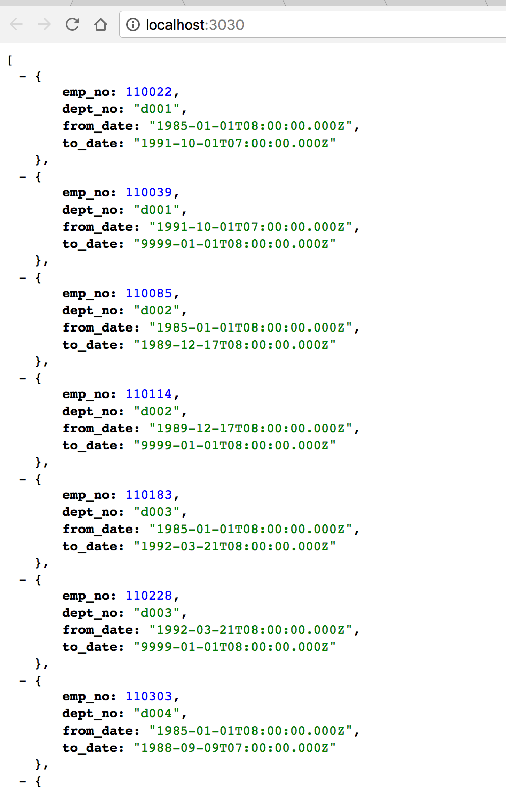

# The Best DB Visualizer Tool Ever Made Ever. Period.

This is a pretty cool db visualization tool. It lets you visualize a db. Yup.

## Node Setup

1. Install the latest version of [Node](https://nodejs.org/) (at the time of writing, 7.4.0).
2. Clone the repo with git.
3. Navigate to the repo folder and run `npm install`
4. Once that finishes, run `node index.js`
5. The console should show a message that it is listening on port 3000, go to <http://localhost:3000/> and verify that you can see the test page.

## DB Setup

1. Ensure that MySQL is installed and functional on your local machine (the mechanism for this differs by OS).

2. Create a new superuser - it's not a good practice to routinely use `root` as a user.

`mysql -uroot -p;`
`CREATE USER 'seng371'@'localhost' IDENTIFIED BY 'seng_pass';`
`GRANT ALL PRIVILEGES ON *.* TO 'seng371'@'localhost' WITH GRANT OPTION;`

3. Download and extract database information
`wget https://github.com/datacharmer/test_db/archive/master.zip;`
`unzip master.zip;`

4. Create and populate the sample MySQL **employees** database:
`cd test_db-master/;`
`mysql -useng371 -pseng_pass -t < ./employees.sql;`

5.  Verify data integrity
`time mysql -useng371 -pseng_pass -t < ./test_employees_sha.sql;`
`time mysql -useng371 -pseng_pass -t < ./test_employees_md5.sql;`

6.  Run the **mysql_queries** module to verify that you can connect to your database
`node mysql_queries`

7.  Open your browser to [localhost:3030](http://localhost:3030) and verify that you can see the JSON response, as shown here (using [JSONView for Chrome](https://chrome.google.com/webstore/detail/jsonview/chklaanhfefbnpoihckbnefhakgolnmc)):

The `employees` database has the following schema:

